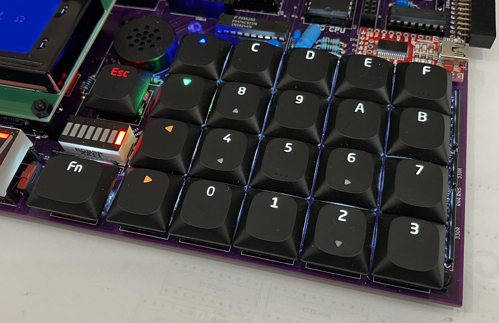
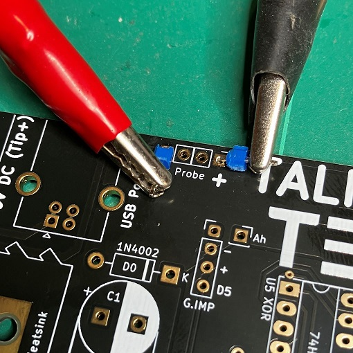
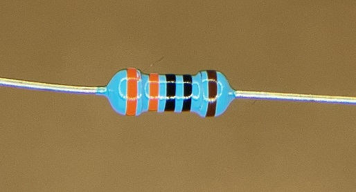
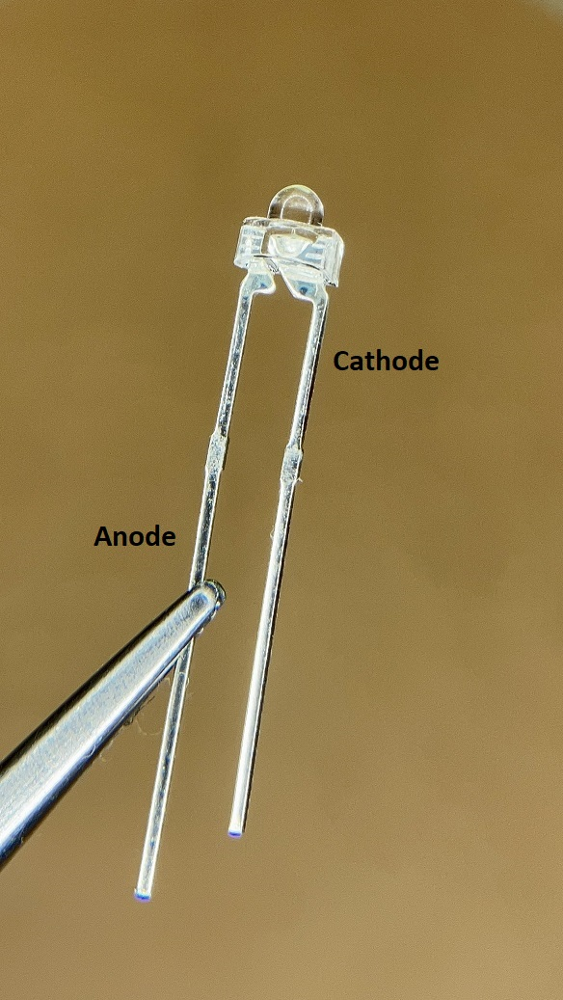
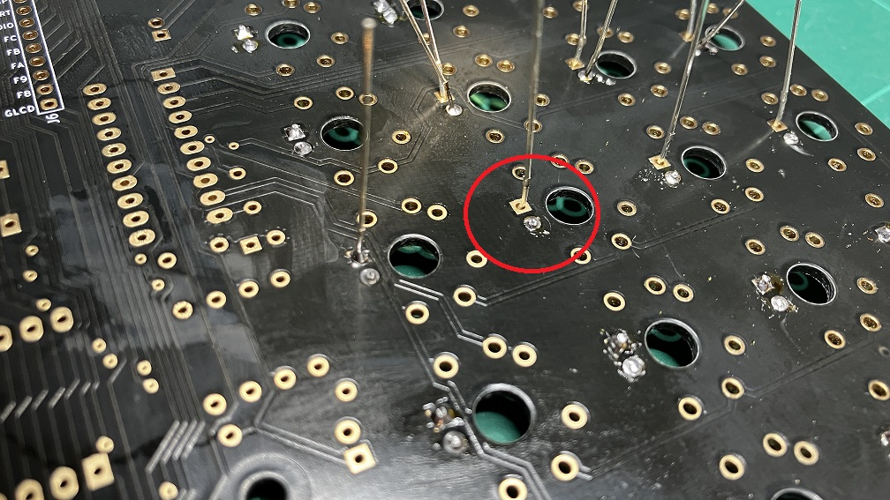
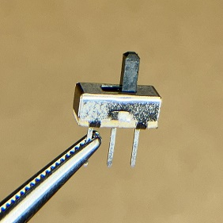
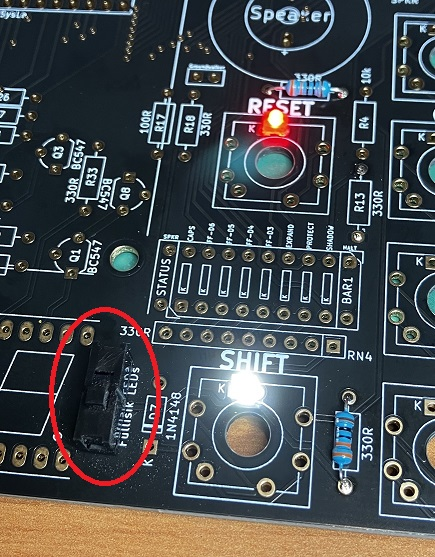
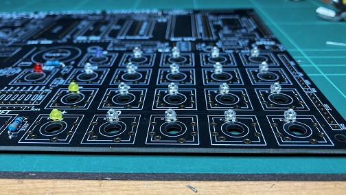
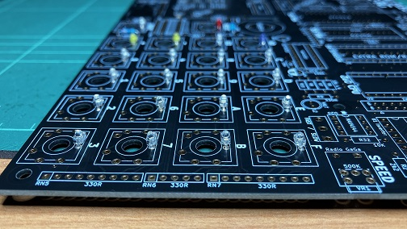
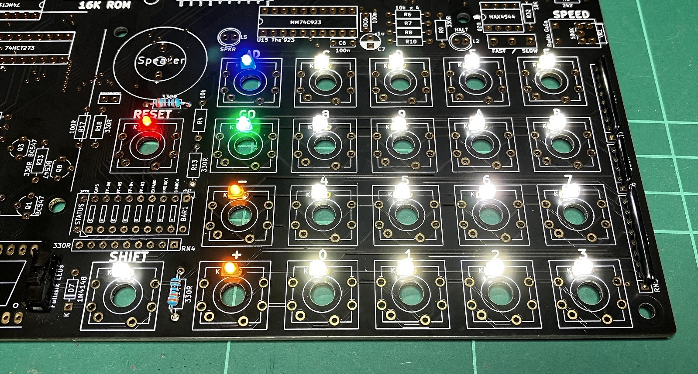

# Assembly Instructions

## 2. The Fullisik Keyboard
So you've opted for the top of the line, sexiest keyboard to ever grace a Single Board Computer. I don't blame you. 
Back when the TEC-1 was... just a 1... I bought the kit from Talking Electronics and it came with the spongiest, most
unresponsive and bouncy keys I had ever had the misfortune of touching.


It took me about 13.2 seconds to decide that this would not do and set about making a mechanical keyboard of my own, all the way back then.


When designing the TEC-1G, there was no way I would go backwards from what I had back in 1983, so of course I had to add under-body LEDs to make it Fully Sick, bro!



OK, enough history, onto the assembly...

---

### Step 1. Power Supply
You might as well crack out the bench power supply early as you will be needing it very shortly.
Set it to 5.0 volts and connect it to the Probe connector at the top left of the board. You might want to do as I did
and solder in two temporary pins to allow easy connection with alligator clips. Power up your Power Supply and make sure
there are no shorts and that you do indeed have the correct polarity coming out of the supply.



(Note that on the Anniversary Editions of the board, the silkscreen is incorrect as well as other issues.
See the Errata page for things you need to do to the board **BEFORE** starting assembly.)

### Step 2. Soldering
There are two 330 ohm Resistors that are connected to the tiny 1.8mm LEDs, one (R5) above the Reset switch
and the other (R14) to the right of the Shift (Function) key.  These need to be soldered in first.

 

Once you have the resistors soldered in place, you can solder in the tiny LEDs, of which the orientation of them is critical!
On the PCB there is a small K and the solder pad is square. This indicates where the Cathode of the diode should go.
Which is the Cathode on those tiny LEDs? The short leg is the Cathode and the other way you can tell is
the larger metal part inside the plastic lens is usually the Cathode.



These little things can be tricky to get plumb and square to the PCB, which is a must, as the Gateron Low Profile
keys have to slip over the LEDs to sit flat. So this is the best time for me to give you my technique for
soldering all components. I call it my One Pin Method.



### One Pin Method of Soldering (for the OCD in all of us)
```
When you insert a through-hole component, I always bend the legs out a little
to keep the item in place while I flip the board over. Once flipped though,
if you have followed the Golden Rule of "lowest components first" then
the component should be pressed down to the PCB fairly well, so you can straighten
one of the legs that you will solder first. Go ahead and do so.

**BUT**... Do not solder the other leg, just yet. Now you have to do some gymnastics
with the board. (And I'll try to make a video of this at some point.)

Flip the board over and you will likely see the component you just soldered
the single leg of is often NOT sitting flush with the PCB, or in the case of these
micro LEDs, it may be leaning over in the X or Y axis.

What you need to do is then turn the PCB on its edge, so that you can push
(with your finger of your non-soldering hand) on the component that is askew,
WHILE you touch on the one soldered pin/pad, just enough to melt it and allow you
to move the component in place; either making it flat to the PCB
or lining up the micro LED to be upright and square. You may need to repeat this a few times
to get it right. Practice makes perfect.

Once you have it perfect (and feel free to do a trial fit on an actual key over the LED)
then you can solder the other pin(s) of the components to get a perfect, OCD-free finish.
```
I use a RED coloured LED for the Reset button, and a WHITE coloured one for the Function key.

The final thing to install before testing is the micro slide switch. Once again, use the One Pin Method to 
make sure the switch is straight and perpendicular. (Unfortunately this breaks the Golden Rule of soldering
because it is taller than the components you will be installing, soon. Oh well, rules are made to be broken, right?)



### Step 3. Testing!
Do a quick test by connecting your bench power supply, to ensure you have the correct resistors selected,
and the polarity of the LEDs correct. Flick the Fullisik switch and if they light up, NICE!
If not, check your power first, then check the soldering on those four components, and lastly, 
you might still have flipped the LED around. Desolder it carefully, flip them around and solder them again.
Test it again. Keep checking everything until you get the result below.



### Step 4. More Soldering
All the rest of the LEDs can now be soldered in, again, being careful with the orientation of the Cathode 
and fussy about the alignment of positioning of the LEDs and ensuring the keys can slip over them.

 

I suggest doing them one column at a time, for sanity's sake.  White LEDs for the alphanumeric keys,
Yellow for the Plus (right) and Minus (left) keys. Green for GO (Enter) and Blue for AD (ESC).

With all those done, the Resistor Networks need to go in last, and using the One Pin Method, tacking in one
pin of the network, lining it up (they like to flop around) and then soldering the rest of the pins.


### Step 5. More Testing
With all the soldering for this section complete, connect up your bench power supply again, and flick the Fullisik
switch on. You should get a warm sensation in your stomach, and a cheesy grin on your face, knowing
you have made the world a better place, by making it Fullisik, Bro!



---

OK, looking great! Now let's get onto [The Power Circuit](./Power.md)
