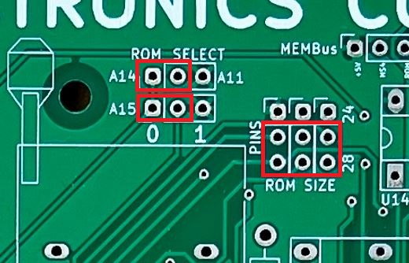
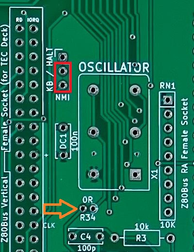
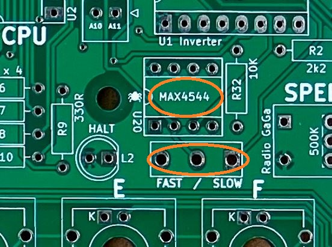
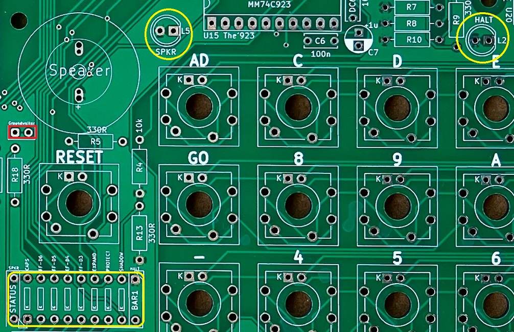
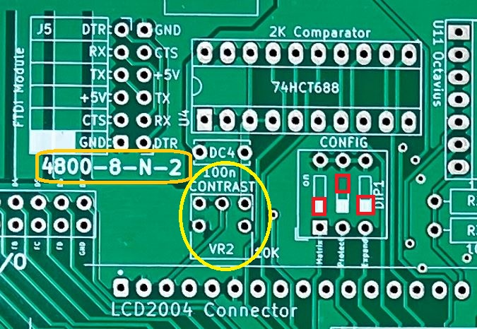

# TEC-1G - Jumpers & Switches

## EPROM - Pin 1
Make sure Pin 1 of the EPROM (whether it is the 28 or the 24 pin package) is situated at the bottom Right. 
 

## EPROM Jumpers
The highlighted positions (three jumpers down on the "28 pin") will configure the chip to run MON3. Use the A14 and A15 switches/jumpers to switch between the monitors. 
 

## EXPAND Jumpers
For 32K chips like the 62256 or the upcoming 32K FRAM, the highlighted jumpers or switches need to be set. 
 

## NMI Jumper & Wire Link
To enable the 923 doing an NMI (as done in MON1 and MON2), this jumper needs to connect pins as highlighted. Also, don't forget the wire link you need for clock signal. 
 

## Speed Switch
You CANNOT have both the SPEED switch and the Max4544 chip installed. 
 

## Speaker Jumper & LEDs 
No need to place a shunt on the Groundwalker jumper, unless you have cut the track on the bottom of the PCB. 
You CANNOT have a 10Bar LED for the Status LEDs, and have the individual Speaker and Halt LEDs installed. It's one or the other. If you want the individual LEDs, use the 8Bar provided in the kit, or use a 10Bar and cut the legs off the outside ones. 
 

## Config Switch
These are the recommended settings. These are explained in the MON3 User Guide. 
 

## G.IMP
Shorting the highlighted pins makes the Break Point routine skip through as if you pressed the Go button. 
 
