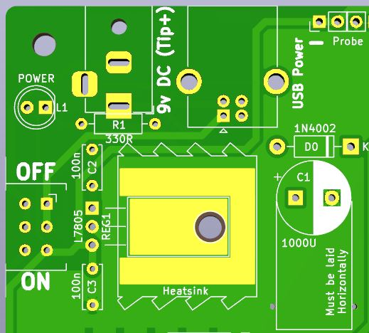
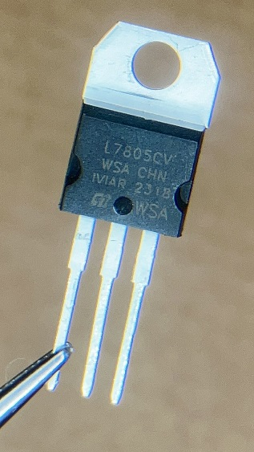
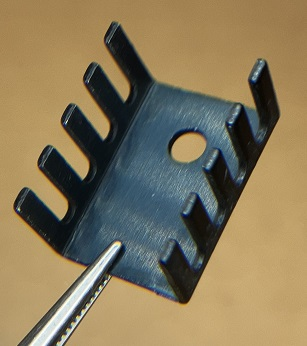
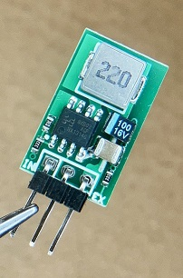
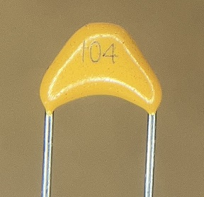
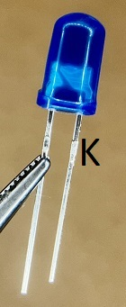
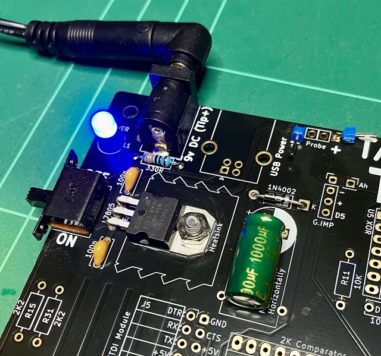

# Assembly Instructions

## 3. The Power Delivery Circuit

With only nine (9) components to install in this section, this may seem too short to write up separately, but this is one of the most crucial parts of the build.
Here is the list of parts you need:

| Ref# | Part | Value |
|---|---|---|
| BJ1 | Barrel Jack | Socket 2.1mm|
|SW1 | Power Switch | DPDT Slide|
|D0 | Rectifying Diode | 1N4001-7|
|C1 | Electrolytic Capacitor | 1000uf|
|C2 | Smoothing Capacitor | 100n|
|C3 | Smoothing Capacitor | 100n|
|REG1 | 5V Regulator | L7805|
|R1 | Resistor | 330R|
|L1 | Power LED | Blue 5mm|
|USB1 | USB-B Socket | (Optional - See Notes Below)|

As with any building (the real ones we live in), you must have a solid foundation that you can rely on and be 100% certain is the bedrock of your build; so it is the same with a proper power circuit that is tested to work and delivers power correctly to where it needs to go and not where it shouldn't.

### The 7805 Regulator
The TEC-1G, as with most other Z80 machines of the time, works on a single 5v power supply. We could get a power pack and feed 5v directly into system, but those are not always easy to come by and you might find you have a 9v pack instead. Accidentally plug one of those in and you can kiss goodbye any number of chips. Hence, since the first days of the TEC-1, they have had a 5v regulator by means of the 7805.

These regulators work very reliably, up to 1.0 to 1.5 amps as long as you have edequate heat dispersal. They can generate quite a bit or heat if put them under heavy load or have to deal with a high input voltage. But they also need a high enough input voltage before they operate correctly. So overall, they are not very efficient and can make a lot of heat that did cause problems with enclosed systems like the ZX Spectrum.

To help with heat disipation, the TEC-1G has a largish flow of copper on the top of the board that will help in that regard. Make sure you use some heatsink compound (nowhere near as much as in the photo; half that would have been enough) between the board to make a better thermal contact. Then use a 3mm bolt and nut to secure it to the board.

When the full build is complete, keep an eye (finger) on the heat coming off the 7805 and if it is too warm to the touch, try decreasing your input voltage (minimum 7v) or you can also insert a small heatsink between the 7805 and the board. Again, use heatsink compound on any surface that touches and needs to tranfer heat, and bolt it tightly together.

### Buck Regulators
Now there is a new kid on the block that might be of interest and if you find the heat coming off the 7805 and heatsink is too great (you should be able to keep your finger comfortably on the regulator for at least 3 seconds) then you may want to try a "Buck Regulator". These operate at much higher efficiency (something you may want to keep in mind if you ever run the TEC-1G off batteries) of around 95%, generate next to no heat at all and are available in 1A to 3A in small form factors that are no bigger than the 7805. Worth the $5 or so you will pay for one.

### Build Order

As with Any PCB assembly, start with the components with the least height, so that when you flip the board over to actually solder, gravity is helping keep the component pressed against the board. Don't forget to use the "One Pin Method" if you have OCD like me. (Don't judge me!)
1. Solder in the 330 ohm resistor
   

2. Next comes the Rectifying Diode. Make sure you orient this the right way, lining up the band on the diode to the band indicated on the board. Get this wrong and the diode will block rather than pass through any power. (This diode also protects the TEC-1G from accidental reverse polarity plugs.)

3. The L7805 regulator is next. You need to bend the pins 90 degress (just where the pins get skinny) so that the hole in the upper metal tab lines up with the hole in the PCB. After it is soldered in place, add a small dab of heatsink compound and bolt it down the PCB. If you have the heatsink, add that in later in the build, as one of the last things due to the height it adds to the board. Don't forget to add heatsink compound to both the heatsink surfaces then bolt it all together. Clean up any excess compound with a tissue.

4. Solder in the two little 100n (104) smoothing capacitors.

5. The Power Switch can be next. Make sure you press it in firmly before begenning to solder.

6. The Blue LED can go next, keeping in mind the orientation of the Cathode.

### Testing
Time to crack out the multimeter!

