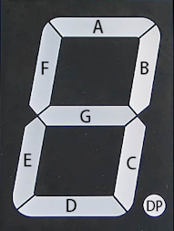

# TEC-1G Z80 I/O Ports

The following technical documentation describes the general layout of the TEC-1G's Z80 CPU I/O ports, as accessed by the IN and OUT instructions.

If you are looking for physical pinouts of the TEC-1G port connectors, please refer to other documentation from the index.

## TEC-1 Compatable IO Ports

** Note that the IO port decoder chip for ports $00 to $07 does not check bit D7 - hence I/O ports $00 to $07 are also available as ports $80 to $87. This is for various 2-port devices like the LCD and GLCD, as well as older model TEC compatability.

### Port 00 - Keyboard data input
 - bits 0-4 - binary keypressed value from the 74c923 chip
 - bit 5 - Shift key status
     - 0 = Shift Key Pressed  
 - bit 6 - not connected
 - bit 7 - not connected

### Port 01 - 7-seg display select & speaker output
 - bits 5-0 selects each 7-segment display, bit 5 = left, bit 0 = right
 - bit  6 - FTDI serial output
 - bit  7 - speaker output

### Port 02 - 7-seg segment select output
 - bit 0 - segment a
 - bit 1 - segment f
 - bit 2 - segment g
 - bit 3 - segment b
 - bit 4 - decimal point
 - bit 5 - segment c
 - bit 6 - segment e
 - bit 7 - segment d

### Port 03 - General SIMP Input

 - bit 0 - config bit 0 - Matrix
     - Matrix keyboard enabled for use in MON-3
 - bit 1 - config bit 1 - Protect
     - Memory protection enabled in MON-3
 - bit 2 - config bit 2 - Expand
     - Indicates which half of a 32k memory device installed in Bank 2, MON-3 should enable by default
 - bit 3 - EXPAND
     - Indicates which half of a 32k memory device installed in Bank 2 is presently selected
 - bit 4 - CART
     - 0 = a ROM/RAM cartridge is installed. Read from IOBUS connector
 - bit 5 - INPUT
     - General purpose input-bit, connected to INPUT pin
 - bit 6 - KDA
 -   - 0 = 74c923 key is pressed
 - bit 7 - FTDI serial input

### Port 04 - LCD Display command

 - bits 0-7 - LCD command register

### Port 84h - LCD Display data

 - bits 0-7 - LCD data register

### Port 05 - 8x8 display latch

### Port 06 - 8x8 display latch

### Port 07 - GLCD port
 - Reserved for future 128x64 Graphic LCD

** Ports $80 to $87 are duplicates of ports $00 to $07.

## TEC-1G New Ports

These are new additions to the 1G, not found in previous TEC models.

### Port FEh - Matrix Keyboard Input

** This port is used to read the state of the matrix keyboard, to determine if a key is being pressed or not. See the section on the Matrix keyboard for more details on how to use port FEh correctly.

 - bits 0-7 - key state

### Port FFh - System Latch

** This register defaults to $00 at power-on and reset.
** this is a write-only register, however key status bits can be read from the SIMP input port to determine the current system configuration state.

** Each bit of this port is also represented on the LED STATUS bar, with bit 0 being rightmost. Note that bit 0, being active low, will be lit at power-on and reset.

 - bit 0 - /SHADOW
     - 0 = Shadow enabled. The first 2k of ROM at $C000 is also mapped to $0000 - $07FF for backwards compatibility with old MONitors.
     - 1 = Shadow disabled. The full 32k of RAM is avlilable from $0000 to $7FFF
 - bit 1 - PROTECT
     - 0 = RAM memory operates as normal read/write memory
     - 1 = Bank 1 of RAM memory ($4000 to $7FFF) is write-protected
 - bit 2 - EXPAND
     - controls which half of a 32k memory device installed in Bank 2 is presently selected. Defaults to the lower half at power on
 - bit 3 - FF-D3 - The next 4 bits are most likely going to be used for Paged Memory expansion, allowing for up to 512k extra memory.
 - bit 4 - FF-D4 - But they are open to be used as users see fit when designing TEC Decks.
 - bit 5 - FF-D5 - Possible Paged Memory use.
 - bit 6 - FF-D6 - Possible Paged Memory use.
 - bit 7 - CAPS
     - This bit relates to the Matrix keyboard
     - 0 - Caps lock is OFF
     - 1 - Caps lock is ON

   
