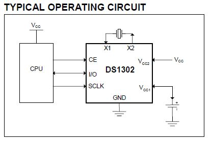

# GPIO Real Time Clock (RTC) Board
| File | Description | Version |
|---|---|---|
| [Schematic](TEC-1G_GPIO_RTC_Schematic_v1-0.pdf) | It's a simple circuit, but it's honest timekeeping. | 1.0 |
| [Parts List](./Partslist.md) | What you need to buy (and comes in the Kit) | 1.0 |
| [Assembly Instructions](./Assembly.md) | Coming Soon... | 1.0 |
| [PCB Gerbers]() | Coming Soon... | 1.0 |
| [Sample Programs](./Programs/) | Sample code and API reference | 1.0 |
| [RTC_Programming_notes](./RTC_Programming_notes.md) | Programmers notes | 1.0 |

## What Does it Do?
It keeps accurate real time, once set, and is battery backed. So even after you switch your TEC-1G off, 
the RTC chip will be powered and will continue to keep accurate time. Oh and it has some battery backed RAM,
a full 31 bytes for you to use for saving variables or settings between power ups. 
We will be calling it PRAM from here on in, short for Parameter RAM, as that is what we will be using it for.

## How Does It Work
The circuit is based around the very cheap and widely used timekeeping chip, the DS1302. 
The DS1302 uses a very simple 3 wire serial interface to communicate with it, so the extra chips you see on the board are basically
just to help with serial communications.

## Why Build It?
Since you first built the TEC-1, be it the original like I did, or the latest TEC-1G... Did you look at those six 7 Segment displays
and think:

<b>"Man, that would make a perfect digital clock!"</b>

I did, but there was never a way to keep the clock actually accurate, until now!

But there are other uses as well. With the TEC-1G GPIO SD Card, you will soon be able to save your files... 
But isn't it important to know WHEN you saved that last file, or made chnages to it?
With the RTC Board in place, you can get the correct time and write it to the file so you know when the last time you made edits.

Want more reasons? 
- How long did it take you to solve that Puzzle Game?
- Writing a game that has critical timing or has a time element to make it exciting?
- How about making an automation system for your home, turning on the Christmas lights at sunset?
- Need the sprinklers to come on at a certain time?
- Want to control your model train based on a strict timing schedule?
- What about saving some settings in the battery-backed 31 bytes?

These are just some of the reason you may want an Real Time Clock. 
For me, I want to finally be able to hang up my TEC-1G for the world to see how clever I am with a soldering iron. :)
Oh, and finally be able to answer the question I *always* get: "So what can it do?" 
It can be a CLOCK! That's what is can do! Now stop picking on my hobby! ;)

## How Do You Use It?
Version 1.4 of MON3 has some new APIs included that allow you to set and retreive the time, as we as set and retreive the battery backed bytes in the DS1302 chip. Brian has also modified the main menu, so that under the Settings Menu, there is an option to configure the Real Time Clock.

Here is the data sheet if you're interested to find out exactly how it works: [DS1302 Spec Sheet](./DS1302_RTC_Timekeeper.pdf) 
